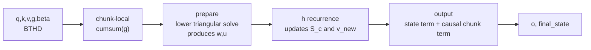
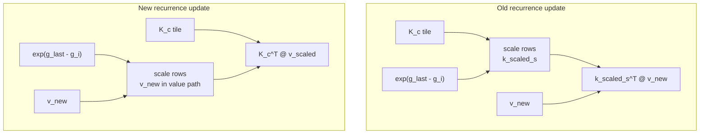
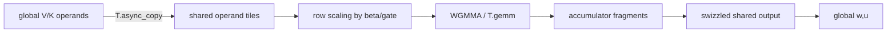
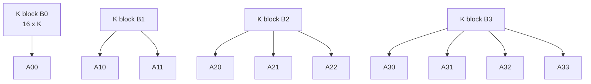

# Agentic TileLang Kernel Tuning: Gated DeltaNet Prefill

Draft status: v2 working draft. This version follows `drafts/blog_plan_v2.md`
and uses `drafts/final_p1_evidence_20260620.md`, including the 2026-06-22
PR-head benchmark rerun, as its Priority 1 evidence base.

Figure note: Figures 1-4 are Mermaid placeholders for final publication
graphics.

## 0. Terminology And Evidence

Source references are listed at the end. The local evidence archive for this
draft is `drafts/final_p1_evidence_20260620.md`, especially the 2026-06-22
PR-head rerun section.

Terminology used below:

| Term | Meaning in this article |
| --- | --- |
| GDN | Gated DeltaNet, a linear recurrent architecture combining decay gates and delta-rule updates. |
| FLA | Flash Linear Attention, the external reference implementation used for fair full-op comparison. |
| Triton | A Python-embedded DSL and compiler stack for writing GPU kernels; FLA and earlier TileOps components use Triton kernels as expert references. |
| BTHD | Tensor layout `[batch, time, heads, dim]`, used by FLA/Qwen-style serving. |
| BHTD | Tensor layout `[batch, heads, time, dim]`, retained as a TileOps-compatible path but not the main serving layout in this article. |
| chunk | A fixed token block of length `C`; the production fast path discussed here uses `C = 64`. |
| prepare | The chunk-local triangular-system stage that produces `w` and `u`. |
| h recurrence | The cross-chunk recurrent state update over the `[K, V]` state matrix. |
| HBM | High-bandwidth GPU global memory. |
| WGMMA | Warp-group matrix multiply-accumulate on NVIDIA Hopper-class GPUs. |
| `ldmatrix` | CUDA/PTX instruction family for loading shared-memory matrix tiles into registers for tensor-core operations. |
| fragment | A register-level matrix tile used as an operand or accumulator for tensor-core operations. |
| fragment recirculation | Reusing a fragment produced by one small GEMM as an input fragment for later small GEMMs without routing through shared/global memory. |
| `cp.async` | NVIDIA asynchronous global-to-shared copy primitive. |
| swizzled shared layout | A shared-memory layout chosen to reduce bank conflicts and match tensor-core load/store patterns. |
| Gram block | A small matrix of pairwise inner products, such as `K_i K_j^T`, used to build the chunk-local lower-triangular solve matrix. |
| Neumann solve | An inverse approximation that uses one or more correction terms from a Neumann-series-style expansion. |
| AKO | Agentic Kernel Optimization: scoped candidate generation plus compile/test/benchmark/log feedback. |

## 1. Why GDN Prefill Is Important And Hard To Tune

Gated DeltaNet (GDN) prefill is a useful stress test for TileLang because it is
not "just another GEMM." It combines recurrent model structure, chunk-local
causal dependencies, long-sequence parallelism, and a hardware pipeline that is
sensitive to where every intermediate lives. A mathematically equivalent
rewrite can be faster or slower depending on whether it removes a shared-memory
buffer, changes a store path, or exposes a tensor-core-friendly tile.

That combination matters for current model systems. Gated DeltaNet belongs to
the recent family of recurrent and linear-attention architectures built for
long-context inference. Compared with standard attention, it avoids a full
quadratic attention matrix. Compared with a plain state-space recurrence, it
adds delta-rule updates and gated chunk-local interactions. The result is an
operator with attractive long-context behavior, but prefill has to process many
tokens in parallel while preserving the same causal state updates that a
token-by-token recurrence would produce.

The tuning problem therefore lives at several layers at once.

At the mathematical layer, each token reads from and writes to a recurrent
state with shape `[K, V]`. Inside a chunk, those reads and writes create a
lower-triangular dependency pattern. A fast implementation cannot simply run
the token recurrence serially; it has to convert that dependency into a
prepare representation, such as a triangular solve or blocked inverse form,
that the GPU can execute efficiently.

At the parallel-algorithm layer, work must be split across chunks, heads, and
sub-blocks. Some pieces are naturally parallel. Others, especially the
cross-chunk state update, require either replaying a recurrence or recognizing
an associative structure that can be scanned. Choosing that decomposition is
not a cosmetic implementation detail; it decides what the later kernel search
is allowed to optimize.

At the hardware layer, the same equations can map to very different pipelines.
Data may travel through HBM, shared memory, tensor-core fragments, swizzled
shared layouts, and global stores. In this project, several early candidates
were correct and even used the expected primitives, but were still slow because
the output path or staging layout was wrong. Performance came from aligning
the mathematical decomposition with the actual memory and tensor-core pipeline.

At the shape-sensitivity layer, correctness and speed are not universal
properties of a single kernel body. A path that works well for S32K/H16 may not
be the right path for H32, a different chunk size, or a different serving
layout. That makes shape-aware dispatch and scoped claims part of the technical
problem, not just an after-the-fact benchmarking rule.

This is why the benchmark rows in this article are deliberately narrow. GDN is
not only a paper operator; public serving stacks now support it in production
models. Qwen3-Next uses Gated DeltaNet as the linear-attention component in a
hybrid architecture, and NVIDIA's Megatron Bridge framework documents GDN
integration for Qwen 3.5 deployment. The rows we measure target that kind of
long-prefill serving path: BTHD layout for FLA/Qwen-style inputs, `B=1` for
single-request long-context prefill, `DK=DV=128`, `chunk64`, and `fp16`.
The sequence lengths 32K, 64K, and 128K target the regime where linear
attention's O(N) complexity advantage over standard attention's O(N^2) becomes
critical: 32K as an entry long-context row where standard attention starts
becoming expensive, 64K in the commonly advertised serving range for
long-context models, and 128K as a stress row testing scalability beyond
typical production loads. H16 is the primary Qwen-like target in our current
TileOps workload, while H32 tests whether the implementation remains
competitive under wider head configurations, directly probing the
shape-sensitivity layer where dispatch must choose the right path for each
head count. These rows are representative of the target serving problem, not a
claim that every deployed checkpoint uses exactly the same shape.

These layers create different optimization surfaces. Some are well suited to
agentic search, such as local algebraic rewrites and hardware pipeline tuning.
Others require human algorithmic insight, such as changing a recurrence into a
scan or deciding that prepare should be treated as a blocked inverse problem.
All of them need production validation against strong references: Flash Linear
Attention (FLA) for full-op behavior and Triton kernels where earlier expert
components existed.

Our approach follows from that split:

```text
derive the computation graph -> expose component benchmarks -> build
correctness/performance gates -> use agents to search TileLang implementations
-> use human algorithmic insight to reshape the hard parts -> accept only what
survives production gates
```

The final validated BTHD (`[batch, time, heads, dim]`) path is fully TileLang
for the prefill kernel surface discussed here. On the PR-head docker rerun, it
is ahead of FLA 0.5.1 on all validated rows, from 1.01860x at S32K/H16 to
1.16167x at S128K/H16, with the H32/S128K row at 1.10828x (full table in
Section 11).

Those numbers are the outcome, not the method. The reusable part is the tuning
discipline: make the operator measurable, let agents search implementation
space where the contract is clear, use human algorithmic insight to reshape
the search space when necessary, and let production gates decide what survives.

## 2. TileLang As The Tuning Surface

This section introduces only the TileLang concepts needed for the GDN tuning
story. The point is not to teach the whole platform; it is to make the later
optimization decisions legible.

TileLang gives the programmer enough control to express GPU kernel structure,
while keeping the edit/compile/benchmark loop accessible from Python. That
matters for agentic optimization. An agent can only search effectively when the
search space is explicit and the feedback loop is short.

For this project, the relevant hardware model is:

```text
HBM/global memory
  -> async or vectorized global-to-shared copies
shared memory
  -> ldmatrix loads into tensor-core operand fragments
WGMMA / MMA fragments
  -> fragment accumulation
shared or global store path
```

Most failed candidates were not "mathematically wrong"; they expressed the
math in a way that created the wrong hardware pipeline. For example, a
candidate can contain `T.async_copy` and still be slow if the later output
store path serializes or uses an inefficient layout. This is why we inspect
both latency and generated/lowered code.

The important TileLang features in this case study are:

- explicit shared-memory buffers and fragment allocations;
- `T.copy` and `T.async_copy` for controlled data movement;
- explicit waits such as `T.ptx_wait_group(0)` before consuming async-copied
  shared tiles;
- layout annotations such as swizzled shared memory, where shared-memory tiles
  are arranged to reduce bank conflicts and match tensor-core load/store
  patterns;
- shape-specific JIT kernels and dispatch;
- Python benchmark harnesses that can isolate one component at a time.

These are not API details for their own sake. In Round 2, recompute candidates
used async copies but still lost until the output store path was changed. In
Round 3, the blocksolve-A replacement ran into a real expressiveness boundary:
the Triton-style fragment recirculation pattern did not map directly into
stock TileLang 0.1.9, so the accepted route used shared solve tiles instead.

This article is not a TileLang API tour. We will introduce each feature only
when it explains a tuning decision.

## 3. Computation Graph And Formulas

Before looking at chunkwise prefill, it helps to read GDN as a recurrent
key-value memory. Each `(batch, head)` stream maintains a state matrix `S`.
At each token, the gate `g_t` decays or forgets the old state, the key `k_t`
reads what the state already predicts for the value, the delta-rule update
uses `beta_t * (v_t - read_t)` to write only the residual information, and the
query `q_t` reads from the updated state to produce the output.

In short:

```text
forget old state -> read with k_t -> write delta residual -> read output with q_t
```

This is only the kernel-facing summary of GDN; the model motivation and full
derivation are in the Gated Delta Networks paper. For the tuning story here,
the important point is that the model wants a causal recurrent update, while
prefill wants to process a long prefix in parallel. The chunkwise
implementation below is the bridge between those two requirements.

### 3.1 Shapes And Notation

Using the BTHD convention, the prefill inputs are:

```text
q, k: [B, T, H, K]
v:    [B, T, H, V]
g:    [B, T, H]
beta: [B, T, H]
```

The public op returns:

```text
o:           [B, T, H, V]
final_state: [B, H, K, V]
```

Each `(batch, head)` stream owns a recurrent state with shape `[K, V]`.

For one `(batch, head)` stream, write:

```text
q_t, k_t in R^K
v_t       in R^V
g_t       scalar log-space decay gate
beta_t    scalar delta-rule update gate
S_t       in R^{K x V}, recurrent state
```

The exact left/right orientation differs between mathematical papers and code,
so this article follows the implementation convention: `k` and `q` index the
state's `K` dimension, while `v` indexes the `V` dimension.

At token level, the dependency pattern is:

```text
read_t   = k_t^T S_{t-1}                  # vector in R^V
v_new_t  = beta_t * (v_t - read_t)         # vector in R^V
S_t      = exp(g_t) * S_{t-1} + k_t v_new_t^T
o_t      = q_t^T S_t
```

This schematic recurrence is enough to see the kernel problem: each token both
reads from and writes to a recurrent state. Prefill must expose parallelism
without changing the causal result.

This is why naive parallelization fails: token `t` cannot produce its output
without the state that includes previous tokens. The rest of the operator is
about transforming that serial-looking dependency into chunk-local work plus a
cross-chunk state update.

### 3.2 Chunkwise Pipeline

For a chunk of `C` tokens, collect:

```text
K_c in R^{C x K}
V_c in R^{C x V}
g_c, beta_c in R^C
```

The chunk-local prepare stage builds a lower-triangular interaction matrix.
Ignoring identity terms and implementation orientation details, the important
object has entries:

```text
A_{ij} = beta_i * exp(g_i - g_j) * <k_i, k_j>,  for i > j
A_{ij} = 0,                                      for i <= j
```

The strictly lower triangular structure encodes causal dependencies inside the
chunk. The prepare stage uses this structure to produce `w_c` and `u_c`, which
let later stages avoid a token-by-token forward recurrence inside the chunk.

After prepare, the cross-chunk state update can be written schematically as:

```text
v_new_c = u_c - ((w_c * exp(g_c + g_last)[..., None]) @ S_c)

S_{c+1} = exp(g_last) * S_c
          + (K_c * exp(g_last - g_c)[:, None])^T @ v_new_c
```

The final output combines the state contribution from previous chunks with a
causal intra-chunk contribution:

```text
O_c = exp(g_c)[:, None] * (Q_c @ S_c)
      + causal((Q_c K_c^T) * exp(g_i - g_j)) @ v_new_c
```

These equations create the three-stage implementation map:

1. Chunk-local prepare: resolve causal dependencies inside a chunk and produce
   intermediate `w` and `u`.
2. Cross-chunk recurrence: update the state across chunks and produce
   corrected `v_new`.
3. Output: combine the previous chunk state with the intra-chunk causal
   contribution.

Once the operator is split into prepare, recurrence, and output, each component
can have its own correctness gate, latency gate, and reference implementation.
These three stages are the tuning surface for the rest of the article: Round 1
targets the recurrence, Round 2 targets recompute in the prepare/output
surface, and Round 3 targets blocksolve-A inside prepare.

Figure 1 sketches the dataflow:



This figure is intentionally higher-level than the kernels. The next sections
show how the same dataflow becomes a hardware pipeline.

## 4. Building A Measurable Tuning Loop

At this point we know the mathematical object and the hardware problem. The
next question is what an agent can actually help with.

The useful agent role was not "invent the whole algorithm." It was:

- read existing code and human-provided paper context;
- build correctness-first scaffolds and small benchmarks;
- inspect expert kernels and generated/lowered TileLang code;
- propose local rewrites or alternate TileLang expressions;
- run many compile/test/benchmark iterations;
- keep a decision log of accepted and rejected candidates.

The boundary was equally important:

- the agent could propose a first fusion hypothesis from dataflow, but humans
  reviewed the decomposition;
- the agent could align with an expert Triton pipeline, but not every
  Triton/CUDA fragment pattern was expressible in TileLang;
- the agent could tune inside a Neumann/inverse solve space, but the
  algorithmic framing of that space was human-proposed;
- the agent could optimize a component, but production acceptance required
  full-op tests and shape guards.

That capability boundary led directly to the AKO harness. Agentic tuning is
not free-form prompting; it needs infrastructure that makes every candidate
measurable.

The loop we used was:

```text
choose component and shape -> define correctness gate -> define latency gate ->
inspect reference pipeline -> edit TileLang candidate -> compile -> test ->
benchmark -> inspect lowering/source when needed -> accept/reject -> log
```

For this project, the full-op comparison used:

- BTHD layout, matching FLA/Qwen-style serving;
- `B=1`, `H in {16, 32}`, `DK=DV=128`, `chunk64`, `fp16`;
- FLA 0.5.1 with `output_final_state=True`;
- H200 GPU in the benchmark docker image;
- component benchmarks separated from full-op benchmarks.

The gate infrastructure was more important than any single candidate:

| Gate | Purpose | Example |
| --- | --- | --- |
| Compile gate | reject TileLang expressions that cannot lower | fragment RR blocksolve layout failures |
| Correctness gate | prevent locally fast but wrong candidates | unsafe gate product form rejected after full tests exposed NaNs |
| Component latency gate | make local search cheap and directional | isolated recompute and blocksolve-A benchmarks |
| Lowering/source gate | check whether intended hardware behavior appeared | cp.async, wait groups, swizzled shared store path |
| Full-op gate | ensure component wins survive integration | docker BTHD TileOps vs FLA benchmark |
| Scope gate | avoid unvalidated generalization | report only validated BTHD rows |

This infrastructure does double duty. Before optimization, it makes a baseline
implementation testable and profilable. During optimization, it gives the agent
fast feedback for candidate generation and pruning.

Before the first performance round, the agent's main contribution was turning
the algorithm map into something measurable:

```text
reference code + paper context
  -> prepare / recurrence / output decomposition
  -> correctness-first kernels and tests
  -> component benchmarks
```

This is where the first fusion hypotheses appear. The agent can identify
obvious dataflow boundaries and suggest which intermediate tensors might stay
inside a kernel, but that is only a starting point. The fusion boundary still
needs human review and later performance evidence.

The taxonomy of agent capabilities is clearer after seeing the rounds. We did
not know ahead of time which layer would produce a win, so the search proceeded
in order: tune the recurrence, diagnose recompute, then replace blocksolve-A.

## 5. Round 1: Move The Scale, Remove The Buffer

With the infrastructure in place, the first search target was the h recurrence.
This round addresses the hardware-pipeline layer from Section 1: the same
mathematical update can be fast or slow depending on where data lives. The
accepted candidate removes a staging buffer entirely.

The first clean AKO win came from the h recurrence. The original expression
scaled `k` before multiplying by `v_new`:

```text
S_update = (K_c * scale[:, None])^T @ v_new_c
```

where:

```text
scale_i = exp(g_last - g_i)
```

Because `scale_i` is a scalar per token row, the same update can be written as:

```text
S_update = K_c^T @ (v_new_c * scale[:, None])
```

This is a simple associativity/broadcasting rewrite:

```text
sum_i (scale_i * k_i) v_i^T
  = sum_i k_i (scale_i * v_i)^T
```

The mathematical work is the same, but the hardware work is not. Scaling `k`
requires a staged `k_scaled_s` buffer with shape `[C, K]`. Scaling `v_new`
instead uses the value-side tile already participating in the update. For the
target shape `C=64`, `K=128`, `V=128`, this changes where the per-token scalar
is applied and removes a shared-memory staging buffer from the hot recurrence
kernel.

Figure 2 shows the difference:



Core evidence:

| Variant | H-only latency | Speedup |
| --- | ---: | ---: |
| old: scale `k` into `k_scaled_s` | 2.2725 ms | 1.00x |
| current: scale `v_new` in place | 1.6277 ms | 1.40x |

Core lesson:

```text
In a memory-sensitive kernel, the right question is often not "how do we make
the GEMM faster?" but "why did we create this staging buffer at all?"
```

This example also shows a useful boundary for agentic tuning. The agent did
not change the global recurrence algorithm. It found a fixed-semantics local
rewrite inside one component contract, then validated it with correctness and
latency gates.

The scale-placement rewrite optimized the recurrence path under the current
execution model. A separate human algorithmic move, formulating the recurrence
as an associative scan, changed the long-sequence execution model itself; that
distinction returns in Section 9.

## 6. Round 2: Recompute - Find The Real Bottleneck

The second round confronted reference parity. We had expert Triton code around
the prepare surface, but did not yet know which parts of that pipeline were
essential. The answer came from diagnosing the store path, not simply adding
the expected copy primitive.

The second AKO story started with a production path that still had expert
Triton pieces in the prepare surface. The goal was not to delete Triton for its
own sake. The goal was to understand the useful expert pipeline and find a
TileLang expression that preserved performance under TileLang's current
expressiveness constraints.

The recompute kernel takes the chunk-local solve matrix `A` and reconstructs
`w` and `u`. The arithmetic is mostly small matrix multiplication:

```text
w_block, u_block = A_block @ operand_tile
```

At first glance this looks like a copy/GEMM problem, so many candidates tried
to improve operand staging with `T.async_copy`. That was necessary, but not
sufficient. The decisive diagnostic was the no-store experiment: when the
kernel performed the compute but skipped global writes, latency dropped to
`0.13233657 ms`. That pointed to the output path, not the WGMMA body, as the
dominant issue.

The accepted shape routes the accumulator through swizzled shared memory
(shared-memory tiles arranged to reduce bank conflicts before the final store)
before global store:

```text
global operands -> shared operands -> WGMMA fragments
WGMMA fragments -> swizzled shared output tile -> global w/u
```

Figure 3 sketches the pipeline:



| Candidate | Correctness | TileLang latency | Same-run Triton | Lesson |
| --- | --- | ---: | ---: | --- |
| copy baseline | exact | 0.46791766 ms | 0.30507803 ms | Correct but far behind Triton. |
| no-store diagnostic | skipped by design | 0.13233657 ms | 0.30706382 ms | Compute path was not the bottleneck. |
| shared-copy store | exact | 0.37684782 ms | 0.30497479 ms | Shared staging helped the store path. |
| swizzled async shared-copy | exact | 0.27223574 ms | 0.30525394 ms | Swizzled shared output staging beat same-run Triton. |

The hardware lesson is precise: seeing `cp.async` in the generated source does
not mean the whole pipeline is aligned. You still have to identify where the
kernel pays for synchronization, layout conversion, and stores.

## 7. Round 3: Blocksolve-A - Respect The DSL Boundary

The third round pushed reference parity further. Could TileLang match an expert
kernel that relies on register-resident fragment recirculation? The answer was
"not directly," and that failure became a useful boundary for the DSL.

The blocksolve-A kernel constructs the chunk-local lower-triangular solve
matrix for `C=64`. The expert pipeline splits a chunk into four 16-token
sub-blocks:

```text
chunk64 = [B0, B1, B2, B3], each Bi has 16 tokens
```

It only needs the lower triangular block matrix:

```text
      col
        B0   B1   B2   B3
row B0  A00
    B1  A10  A11
    B2  A20  A21  A22
    B3  A30  A31  A32  A33
```

That is 10 dense `16 x 16` Gram blocks: pairwise inner-product blocks between
the 16-token sub-blocks. The reference Triton pipeline keeps these small
matrices largely register-resident, applies gate/beta scaling, and stores only
the lower blocks. The first TileLang question was whether the same
fragment-recirculation pattern could be expressed directly.

It could not, at least not with stock TileLang 0.1.9 in this experiment. The
candidate that tried to keep the triangular solve entirely in fragments hit
layout inference conflicts: a fragment produced in one GEMM role could not be
reused as both A- and B-layout input in later small GEMMs. That failure is a
useful boundary result, not just a failed candidate.

The competitive TileLang route used shared-memory solve tiles instead:

```text
K tiles -> 10 Gram fragments -> shared lower blocks
shared lower blocks -> Neumann-style small-block solve
                    -> global lower blocks
```

Here "Neumann-style" means approximating the local inverse through correction
terms rather than running a full forward solve.

Figure 4 shows the block structure:



| Candidate | Status | TileLang latency | Reference | Lesson |
| --- | --- | ---: | ---: | --- |
| fragment RR solve | compile failure | n/a | n/a | Direct Triton-style fragment recirculation was not expressible. |
| fp32 shared solve | correct | 0.34256142 ms | 0.15223822 ms | Expressible but too slow. |
| fp16 shared solve | correct | 0.18865764 ms | 0.14846226 ms | Much closer. |
| anchored gate precompute | correct | 0.16825072 ms | 0.19289172 ms | Reduced repeated exponent work safely. |
| one-round Neumann | correct within tolerance | 0.12971870 ms | 0.15802626 ms | Tuning within the inverse space produced the accepted candidate. |
| final production compare | correct within tolerance | 0.11384284 ms | 0.14692616 ms | TileLang blocksolve-A beat local Triton isolated. |

Two details deserve special attention:

1. **Anchored gate precompute.** A naive product form such as
   `exp(g_i) * exp(-g_j)` can overflow in fp16 when cumulative gates become
   large in magnitude. The accepted version uses an anchor per 16-token block
   and computes ratios relative to that anchor, preserving the local difference
   form `exp(g_i - g_j)`.
2. **One-round Neumann solve.** A Neumann series approximates an inverse by
   expanding it as repeated correction terms. The Neumann/inverse framing was a
   human algorithmic choice. Once that space existed, the AKO loop tuned within
   it, reducing diagonal solve rounds from four to one under correctness and
   full-op gates.

The Neumann/inverse framing that made this tuning space available is discussed
again in Section 9 as an example of human algorithmic work that changes what
is worth tuning.

## 8. What The Rounds Teach About Agent Capability

After the optimization story, the agent capability levels become concrete:

| Capability | What changed | Example | Boundary |
| --- | --- | --- | --- |
| Pre-tuning scaffolding | algorithm map, baseline, tests, component benchmarks | prepare / recurrence / output decomposition | human review of equations and fusion boundaries |
| Local algebraic rewrite | same math, different data movement | scale `v_new` instead of staging `k_scaled_s` | fixed component semantics |
| Hardware pipeline diagnosis | identify copy/wait/layout/store bottlenecks | recompute no-store and swizzled shared output path | requires component benchmark and lowering/source gate |
| Expert-kernel alignment | preserve useful structure from Triton/FLA in TileLang | blocksolve-A 4x16 blocks and 10 lower Gram blocks | not every reference pipeline is expressible in TileLang |
| Algorithm-space tuning | tune parameters inside a human-proposed algorithm family | one-round Neumann solve | requires stronger correctness and full-op gates |
| Integration pruning | reject isolated wins that do not survive production | source audit, pytest, docker full-op benchmark | validated shapes only |

The important point is not that agents are universally good at every layer.
They become useful when each layer has a contract: what can change, what must
remain invariant, how correctness is checked, and what latency target matters.

## 9. Human Algorithmic Moves

The sections above describe what agents can do inside a measurable tuning
space. Two important ideas in this project were different: they changed the
space itself.

The first was the Neumann-style prepare/inverse framing. The prepare stage is
not just "do a forward solve." It is a chunk-local triangular system with a
small, repeated block structure. Viewing it as a block inverse problem created
a GPU-friendly implementation space: small block GEMMs, lower triangular block
stores, and tunable solve rounds. The agent tuned inside that space, but the
space was created by the mathematical framing.

The second was the scan formulation of the chunk recurrence. The cross-chunk
state update can be represented as an affine transition:

```text
S_{c+1} = P_c S_c + R_c
```

Two consecutive transitions compose associatively:

```text
(P_2, R_2) o (P_1, R_1)
  = (P_2 P_1, P_2 R_1 + R_2)
```

That observation changes a long serial recurrence into a scan plus replay
problem. It is not universally faster; the current production guard is
shape-aware. In the validated path, H16 long sequences benefit from the scan
formulation. Early dense-transition scan experiments on H32 were less
favorable, but the production H32/S128K row still beats FLA because dispatch can
choose the measured-safe path for that configuration.

This distinction is central to the article:

```text
Agents can aggressively tune a kernel once the structure is chosen. Human
algorithmic insight can change the structure that is worth tuning.
```

## 10. Production Integration

The production bar was stricter than isolated component latency. A candidate
had to satisfy source, correctness, full-op, and scope gates.

Source audit:

```bash
rg -n "triton|tl\." \
  tileops/kernels/gated_deltanet/gated_deltanet_prefill.py
```

Result:

```text
no matches
```

Test result:

```text
pytest tests/ops/test_gated_deltanet_prefill.py -q
8 passed, 2 warnings
```

The component result was strongest on blocksolve-A:

| Backend | Latency |
| --- | ---: |
| Triton local baseline | 0.14692616 ms |
| TileLang production | 0.11384284 ms |

The full-op result also remained ahead of FLA 0.5.1 on the validated BTHD
rows; the publication-quality table appears in Section 11.

The claim is intentionally scoped: BTHD layout, `B=1`, `DK=DV=128`,
`chunk64`, `fp16`, FLA 0.5.1, `output_final_state=True`, H200, and the rows
shown in Section 11. Other shapes need their own gates.

## 11. Performance Progression Against FLA

The tuning story should be visible in the numbers. The table below is a compact
progression for the representative `B=1, H=16, S=32K, DK=DV=128, chunk64,
fp16` row. It is not meant to describe porting details; it shows what happened
after each tuning step was accepted by the benchmark gate.

This progression spans multiple experiment days as the kernel evolved. Each row
passed its benchmark gate before acceptance; what changed between rows was the
code and harness context, not the requirement that a candidate be measured.
Treat this as a tuning narrative showing improvement direction. The docker
table after this section is the single-environment validation. Raw artifacts
are listed in `drafts/final_p1_evidence_20260620.md`.

| Stage | What changed | TileOps | FLA in same run | FLA / TileOps |
| --- | --- | ---: | ---: | ---: |
| Early fused baseline | correct fused prefill path | 2.94714266 ms | 3.12735274 ms | 1.061x |
| H/output configuration search | lower overhead on the same S32K/H16 row | 2.90249746 ms | 3.04965744 ms | 1.051x |
| stronger H16 configuration | better TileLang schedule for the target row | 2.78791612 ms | 3.06059986 ms | 1.098x |
| BTHD serving layout | same public layout as FLA/Qwen-style serving | 2.86260805 ms | 3.12546770 ms | 1.092x |
| TileLang recompute accepted | remove remaining recompute gap in full op | 2.40010169 ms | 2.44990472 ms | 1.021x |
| **final production path (docker)** | **fully TileLang, no Triton component** | **2.39824722 ms** | **2.44284368 ms** | **1.019x** |

The important reading is the left-to-right movement in TileOps latency:

```text
2.947 ms -> 2.902 ms -> 2.788 ms -> 2.863 ms -> 2.400 ms -> 2.398 ms
```

The BTHD row is slightly slower than the previous BHSD tuning point, but it is
the first row in the sequence that measures the serving layout used for the
final comparison. The final row is from the docker benchmark suite; the earlier
rows are directional milestones from intermediate harnesses. After the
recompute and blocksolve-A work, the final production kernel keeps that public
layout and reaches the PR-head docker result below.

Final docker benchmark, same environment and same harness for TileOps and FLA:

| Seq len | Heads | TileOps TileLang | FLA 0.5.1 | FLA / TileOps |
| --- | ---: | ---: | ---: | ---: |
| 32K | 16 | 2.39824722 ms | 2.44284368 ms | 1.01860x |
| 64K | 16 | 4.64622306 ms | 5.20679608 ms | 1.12065x |
| 128K | 16 | 9.35985710 ms | 10.87307050 ms | 1.16167x |
| 128K | 32 | 14.51952280 ms | 16.09163698 ms | 1.10828x |

In the published version, this progression should become a single figure:
x-axis as accepted tuning stages, y-axis as latency, and a nearby final table
for the strict docker comparison against FLA.

## 12. Negative Results That Teach Something

The tuning loop worked because it rejected ideas as aggressively as it accepted
them. Several negative results shaped the final kernel:

| Negative result | What it taught |
| --- | --- |
| Naive TileLang forward solve was slow. | This did not prove the solve idea was bad; it showed that the TileLang version was not yet matching the blocked expert pipeline. |
| `cp.async` alone did not fix recompute. | The bottleneck was the output path and store layout, not just operand loading. |
| Fragment-recirculation blocksolve could not lower cleanly. | Some Triton/CUDA fragment patterns do not map directly into stock TileLang 0.1.9. |
| Dense-transition H32 scan experiments were not favorable. | Associative scan is a search-space expansion, not a universal dispatch rule. |
| Some isolated component wins disappeared in full-op tests. | Production gates must include integration benchmarks, not only microbenchmarks. |

These failures are part of the method. They narrow the search space and make
the accepted path more credible.

## 13. Lessons For TileLang Developers

The details here are specific to Gated DeltaNet, but the workflow generalizes.
The transferable lesson is to make optimization measurable before making it
automatic: define the component boundary, lock correctness, inspect the lowered
pipeline, and let production gates decide what survives.

1. **Start with decomposition, not code edits.** The
   prepare/recurrence/output boundary came before any TileLang kernel. That
   made each component independently testable and created the search space for
   agentic tuning.
2. Build measurable gates before searching.
3. Let agents search implementation space aggressively, but keep the component
   contract explicit.
4. Study expert kernels before replacing them.
5. Inspect generated pipelines; high-level intent is not enough.
6. Keep rejected candidates in the log because they define the next search
   space.
7. Separate algorithmic reframing from local tuning.
8. **Let production gates decide what survives.** Isolated microbenchmark wins
   are useful only if they pass full-op integration, correctness, and
   shape-scoped validation.

For TileLang adoption, that last point matters most. A DSL becomes practical
when developers can move between math, hardware structure, and repeatable
benchmarks without losing sight of the production contract.

## References

- Songlin Yang, Jan Kautz, Ali Hatamizadeh. *Gated Delta Networks: Improving
  Mamba2 with Delta Rule*. ICLR 2025 / arXiv 2412.06464.
  https://arxiv.org/abs/2412.06464
- TileLang documentation, programming guide and layout APIs.
  https://tilelang.com/
- TileLang paper: *TileLang: A Composable Tiled Programming Model for AI
  Systems*. https://arxiv.org/abs/2504.17577
- NVIDIA CUDA Programming Guide, asynchronous data copies.
  https://docs.nvidia.com/cuda/cuda-programming-guide/04-special-topics/async-copies.html
- Flash Linear Attention repository and `chunk_gated_delta_rule` implementation.
  https://github.com/fla-org/flash-linear-attention
- vLLM Team. *vLLM Now Supports Qwen3-Next: Hybrid Architecture with Extreme
  Efficiency*. vLLM Blog, 2025-09-11.
  https://vllm.ai/blog/2025-09-11-qwen3-next
- NVIDIA. *Qwen 3.5 VL Model Integration*. Megatron Bridge Documentation,
  v0.4.1.
  https://docs.nvidia.com/nemo/megatron-bridge/0.4.1/models/vlm/qwen35-vl.html
- Local evidence archive:
  `drafts/final_p1_evidence_20260620.md`.
