# Agentic TileLang Kernel Tuning: Gated DeltaNet Prefill

Draft status: v3 rewrite checkpoint 4. This file rewrites the opening,
Level 1, Level 2, Level 3, and the first formal `64K/H16` evidence package.

Publication status: not final. The `64K/H16` evidence package has been
refreshed under a formal harness, including a public FlashQLA TL0.1.8 anchor
for that shape. Broader-shape tables, public-environment percentage tables, FLA
package identity, and final formula copyediting still need publication review.
The Neumann/blocksolve section now uses implementation-scoped notation and must
keep its ABI caveats.

Figure note: figures below are Mermaid placeholders for final publication
graphics.

## Roadmap And Evidence Contract

This is not a story about an AI magically inventing a faster GPU kernel. It is
a story about how agents become useful when a kernel problem is made
measurable, and where they still need human judgment and expert open-source
references.

The kernel is Gated DeltaNet prefill. It is a good stress test for AI-assisted
kernel work because it is not "just a GEMM." The operator combines
chunk-local causal dependencies, a recurrent key-value memory, gate decay,
delta-rule residual writes, output replay, final-state production, and
shape-sensitive long-context serving. A correct implementation has to preserve
the same causal state updates as token-by-token decode, while prefill wants to
process tens of thousands of tokens efficiently.

The core lesson is:

```text
Agents can reconstruct and refine a measurable search space; experts and
expert kernels reshape it.
```

In this project, the agent was useful in three different roles:

1. **Make the operator correct and measurable.**
   Read paper/reference code, reconstruct the prefill computation, build
   correctness tests, component benchmarks, lowering inspection, and logs.

2. **Search local implementation choices inside a fixed contract.**
   Try TileLang rewrites, memory movement changes, store-path variants,
   scale-placement changes, and small fusion candidates under correctness and
   latency gates.

3. **Implement and tune a new search space once external input changes it.**
   Human mathematical analysis reframed the prepare stage as a blocked
   inverse / Neumann-style producer. Qwen's FlashQLA showed the production
   CP-split replay schedule and fused replay/output skeleton for long
   prefill. TileOps then studied, ported, tuned, dispatched, benchmarked, and
   productionized those ideas in an owned implementation.

That boundary matters. TileOps did not invent the CP-split replay schedule.
The contribution was to study, validate, port, tune, dispatch, benchmark, and
productionize the FlashQLA-style schedule inside TileOps, combined with
TileOps' own A producer. At the same time, the work was not "just copying
FlashQLA": the TileOps path includes an owned BTHD production implementation,
a faster specialized A producer, shape-aware dispatch, correctness validation,
and production benchmark integration.

This article therefore uses a three-level structure rather than a chronological
round diary. The performance story should also be read as a sequence of
milestones, control rows, and anchors, not as disconnected per-section tables.

The rewritten structure is:

| Part | Purpose |
| --- | --- |
| Roadmap and evidence contract | Define the claim boundaries, evidence lanes, and terminology. |
| Part I: operator | Explain why GDN prefill is a recurrent-memory scheduling problem. |
| Part II: Level 1 | Build correctness, benchmark, lowering, and decision gates. |
| Part III: Level 2 | Show local AKO wins and the fixed-contract wall. |
| Part IV: Level 3 | Explain the external search-space expansions: FlashQLA schedule and human blocked-inverse / Neumann prepare. |
| Part V: guardrails and evidence | Separate formal rows, anchors, caveats, negative results, and publication blockers. |

Representative narrative roadmap:

Relative performance is reported as throughput relative to a reference:
`reference_latency / variant_latency * 100%`. `100%` means parity with the
reference; values above `100%` mean the variant has higher throughput than that
reference. Rows marked "diagnostic only" are not performance claims; they mark
where the search changed direction. The measured rows below use
`B=1,T=65536,H=16,DK=DV=128,chunk64,fp16,BTHD`, H200/GPU4, and the same input
artifact hash:
`sha256:a8987a2c6d16c658a1cb8ed95e409d973a3f736e2019d8719b143f18b4741513`.

| Story node | Evidence | Blog meaning | `64K/H16` latency | Perf vs recorded FLA (%) |
| --- | --- | --- | ---: | ---: |
| measurable baseline | `generic_a_legacy` | the operator is correct and measurable, but the legacy replay/output path is slow | `25.3849 ms` | `73.9%` |
| Level 2 wall | direct-fusion and local-fusion diagnostics | local AKO can remove some stores, but it does not shorten the long replay dependency | diagnostic only | not reported |
| Level 3 search-space expansion | FlashQLA CP-split schedule + human blocked-inverse / Neumann prepare | external input changes the schedule and the A producer search space | details later | details later |
| final scoped TileOps row | `tileops_final_dispatch` | production wrapper / dispatch context for the current scoped candidate | `0.722839 ms` | `2594.8%` |

The detailed experiment-adapter chain appears later in the evidence section.
Do not use that adapter chain as the opening story. The opening should first
establish the wall; the intermediate CP adaptation rows only make sense after
the FlashQLA section has explained the external schedule idea.

The FlashQLA-learning sequence is intentionally not introduced here. The
opening should first establish the wall. The later FlashQLA section then
explains how the external schedule idea was studied, adapted, and separated
from the prepare-A question.

Component diagnostics, failed candidates, and migration/lowering anchors belong
in the supporting evidence or appendix. A `TBD` row may appear only as an
explicit publication blocker; it must not be read as a formal result.

The final article should not mix component rows, external FlashQLA anchors, and
TileOps experiment-adapter rows into one apparent speedup ladder.

### Terminology And Scope

The final article will compare TileOps, FLA, and FlashQLA, but their roles are
different:

| Term | Role in this article |
| --- | --- |
| GDN | Gated DeltaNet, a recurrent linear-attention-style operator with decay gates and delta-rule residual writes. |
| FLA | Flash Linear Attention. The main behavioral correctness reference for full-op validation. |
| FlashQLA | Qwen's FlashQLA project. The source of the CP-split GDN prefill schedule and fused replay/output skeleton that TileOps later ported and productionized. |
| TileOps | The production kernel surface discussed here: TileLang-owned BTHD prefill path, dispatch, validation, and benchmark integration. |
| AKO | Agentic Kernel Optimization: a gated loop of hypothesis, implementation, correctness, benchmark, lowering inspection, and decision logging. |
| BTHD | `[batch, time, heads, dim]`, the main serving layout used in the FLA/Qwen-style path discussed here. |
| chunk | A fixed token block. The production path discussed in this work uses `chunk64` for the benchmark rows. |
| prepare | Chunk-local causal work that produces effective writes used by replay/output. |
| replay | Cross-chunk recurrent state update. |
| CP split | FlashQLA-style schedule that computes corrected segment initial states, then runs fused replay/output over shorter segments. |

The target serving shape in the main evidence package is intentionally scoped:
`B=1`, BTHD layout, `DK=DV=128`, `chunk64`, `fp16`, and long prefill lengths.
The article should report final numbers only after the Tier-1 correctness and
benchmark tables have been refreshed for the final PR head and runtime
environment.

For FlashQLA comparisons, the article must keep the following caveat:

```text
TileOps vs FlashQLA is a public-environment comparison, not a controlled
same-lowering replay attribution experiment.
```

## Part I: Understanding The Operator

This part builds the operator model before any kernel tuning appears. The goal
is to make the reader understand why GDN prefill is hard: it is a recurrent
memory update with chunk-local causal work, long cross-chunk replay, and an
output path that must remain equivalent to token-by-token decode.

Standard attention computes pairwise token interactions, even when modern
kernels avoid materializing the full matrix. Linear attention-style models
avoid the full quadratic interaction pattern by maintaining a recurrent state.
Gated DeltaNet adds two important features to that state:

- a decay gate `g`, which controls how much previous memory survives;
- a delta-rule update, which writes residual information instead of blindly
  accumulating values.

At a high level, each token does four things:

```text
forget old memory -> read with k_t -> write a residual -> read output with q_t
```

This gives GDN a useful memory signal-to-noise story: if the current key
already retrieves something close to the current value, the update can write
less redundant information. But it also makes prefill harder. Token `t`
depends on the state produced by earlier tokens, and the prefill kernel must
process a long prefix without changing that causal result.

The difficulty appears at three layers:

1. **Mathematical dependency.**
   Each token both reads from and writes to a recurrent `[K, V]` state. Inside
   a chunk, this creates a causal lower-triangular dependency pattern.

2. **Parallel schedule.**
   Some work is naturally chunk-local. Other work, especially long replay
   across chunks, remains recurrence-like unless the schedule changes.

3. **Hardware pipeline.**
   Equivalent equations can become very different kernels depending on whether
   data lives in HBM, shared memory, tensor-core fragments, or global stores.

This is why a "fused" kernel is not automatically a fast kernel. Fusion can
remove global intermediate tensors, but it does not by itself shorten the
causal replay dependency. That distinction becomes central later when the
article reaches FlashQLA's CP-split schedule.

### GDN As A Recurrent Memory

This section uses implementation-facing schematic notation. The exact
orientation of row/column vectors and the exact gate exponent placement should
be checked against the implementation before publication. The goal here is to
explain the computation shape, not to provide final paper notation.

For one `(batch, head)` stream, the inputs are:

```text
q_t, k_t in R^K
v_t       in R^V
g_t       scalar gate
beta_t    scalar write strength
H_t       in R^{K x V}
```

The decode intuition is:

```text
w_t = beta_t * k_t
u_t = beta_t * v_t

prediction = w_t @ H_{t-1}
residual   = u_t - gated_prediction

o_t = state_read(q_t, H_{t-1}) + local_residual_read(q_t, k_t, residual)
H_t = gated_old_state(H_{t-1}) + residual_write(k_t, residual)
```

The important idea is the residual write. GDN does not simply add
`beta_t * v_t` into memory. It reads what the old memory already predicts
under `k_t`, then writes the remaining information. The gate controls memory
lifetime and coordinate scaling; `beta` controls write strength.

For prefill, the operator cannot run this recurrence token by token. It first
groups tokens into chunks. The chunk-local prepare stage turns intra-chunk
causal dependencies into effective writes:

```text
k_beta = beta[:, None] * k
v_beta = beta[:, None] * v

w = A @ k_beta
u = A @ v_beta
```

Here `A` encodes the lower-triangular chunk-local delta-rule solve. In decode,
`w_t` and `u_t` are just `beta_t k_t` and `beta_t v_t`; in chunkwise prefill,
`w` and `u` are effective writes after absorbing causal dependencies inside
the chunk. This is the first key conceptual split: chunkwise prefill is not
just vectorized decode.

Once `w` and `u` are available, the operator has three stages:

```text
prepare -> replay -> output
```

Schematic code shape:

```python
# Stage 1: chunk-local prepare
A = build_chunk_local_A(k, g, beta)
w, u = recompute_w_u_from_A(k, v, beta, A)

# Stage 2: replay recurrent state across chunks
for chunk in chunks:
    v_new = u_chunk - gated_state_read(w_chunk, H)
    H = gated_state_update(H, k_chunk, v_new)

# Stage 3: output
o_state = state_contribution(q_chunk, H_in)
o_local = causal_chunk_contribution(q_chunk, k_chunk, v_new)
o = o_state + o_local
```

Figure 1 sketches the dataflow.

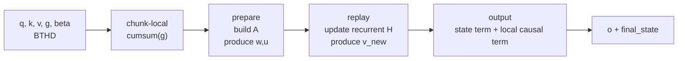

This is the logical operator decomposition. Later production kernels may fuse
replay and output or change the replay schedule, but the same component
boundaries remain useful for testing and attribution.

The figure is deliberately higher-level than a kernel listing. The purpose is
to expose component boundaries that can be tested, timed, and optimized.

## Part II: Level 1 - Make The Operator Measurable

Level 1 is the correctness and measurement layer. Before the agent can tune a
kernel, it needs a reference, a decomposition, a timer, lowering artifacts, and
a decision log that makes each candidate accept/reject outcome auditable.

The first useful agent capability was not performance tuning. It was helping
turn the operator into something that could be tested and measured.

That required four artifacts:

1. **A decomposition.**
   The agent helped organize the computation into `prepare -> replay ->
   output`, matching the shape of the reference implementations and the
   TileOps kernel surface.

2. **A correctness reference.**
   FLA is the main behavioral correctness reference for the full operator.
   FlashQLA is mainly a schedule/source/performance reference unless stated
   otherwise.

3. **A benchmark surface.**
   Full-op latency is necessary, but component latency is what makes local
   tuning directional. Prepare, replay, output, and later CP preprocess need
   separate attribution.

4. **A decision log.**
   Candidate kernels are not accepted because they look plausible. They pass
   compile, correctness, latency, lowering, and integration gates.

This is the AKO loop used throughout the project:

```python
candidate = build_tilelang_kernel(config)
correctness_ref = fla_reference
schedule_ref = flashqla_source_if_needed

correct = check_against_reference(
    candidate,
    reference=correctness_ref,
    shapes=validated_shapes,
)

if correct:
    latency = cupti_bench(
        candidate,
        warmup=warmup,
        repeat=repeat,
        trials=trials,
    )
    lowering = inspect_generated_code(candidate)
else:
    latency = None
    lowering = None

decision_log.write({
    "config": config,
    "correct": correct,
    "latency_ms": latency,
    "lowering_notes": lowering.summary if lowering else None,
    "decision": accept_or_reject(correct, latency, lowering),
})
```

Figure 2 shows the same loop visually.

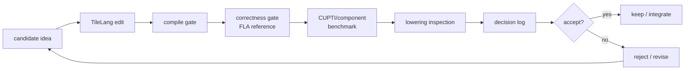

This loop is what makes the agent useful. Without it, "agentic tuning" is just
unbounded code generation. With it, the agent can propose small kernel changes,
run them through the same evidence gates, and build a trace of what worked and
what failed.

The gates also protect the narrative. A historical row can explain why a
candidate was pursued, but it cannot become a final public claim unless it is
refreshed at the final PR head. A source-level similarity can motivate a
migration, but it cannot justify a TMA/WGMMA claim unless the generated code
was inspected and archived. A full-op FlashQLA speedup can be reported under
its environment, but it cannot be described as a replay algorithm superiority
claim without a controlled same-lowering experiment.

That discipline is the base layer for the rest of the article. Level 2 will
show what the agent could optimize inside this measured space: scale
placement, store paths, and early fusion attempts. Level 3 will show what
happened when external input changed the search space: human blocked
inverse/Neumann prepare, and Qwen FlashQLA's CP-split schedule for long replay.

## Part III: Level 2 - Local AKO Inside A Fixed Contract

Level 2 is where local agentic kernel optimization works well. The math and
schedule contract stay fixed, while the agent searches TileLang expression
choices, memory paths, staging choices, and small fusion candidates under the
same correctness and benchmark gates.

Once the operator was measurable, the agent could start doing useful kernel
work. The important phrase is "inside a fixed contract." In Level 2, the
agent is not changing what GDN computes, not changing the long-replay
schedule, and not introducing a new mathematical formulation of prepare. It is
searching implementation choices that should preserve the same component
semantics.

This is the part of the story where agentic tuning works best:

```text
same math
same input/output contract
same correctness reference
different TileLang expression or data path
```

The wins here are real, but they also reveal a ceiling. Local AKO can remove a
buffer, fix a store path, or reject a tempting fusion. It cannot, by itself,
turn a long recurrence into a shorter one unless the search space is changed.
That distinction is the bridge to Level 3.

Figure 3 summarizes the local tuning ladder.

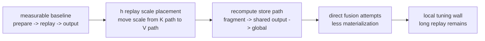

### Local Win: Move The Scale, Remove The Buffer

The first clean local win came from the replay update. The recurrence update
contains a per-token gate scale. One expression scales the key side before the
matrix multiply:

```python
k_scaled = k_chunk * exp(g_last - g_i)[:, None]
H += k_scaled.T @ v_new
```

The equivalent expression scales the value side instead:

```python
v_scaled = v_new * exp(g_last - g_i)[:, None]
H += k_chunk.T @ v_scaled
```

Mathematically this is just moving a scalar across an outer product:

```text
sum_i (scale_i * k_i) v_i^T
  = sum_i k_i (scale_i * v_i)^T
```

But the TileLang kernel sees a different data path. Scaling `k` creates an
extra staged key tile. Scaling `v_new` applies the per-token factor on the
value tile that already flows into the update.

TileLang-shaped snippet:

```python
for i, j in T.Parallel(block_C, BV):
    v_new_c[i, j] *= T.exp2((g_last - g_c[i]) * LOG2E)

T.gemm(k_c, v_new_c, H_next_frag, transpose_A=True)
```

Figure 4 shows the buffer-level difference.

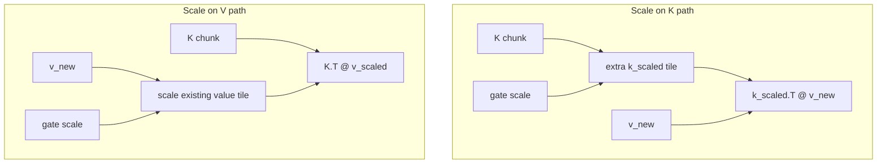

The lesson is not that the agent invented new GDN math. It found a
semantics-preserving algebraic placement that changed the memory path. This
is exactly the kind of search Level 2 is good at: local, testable, and gated
by the same reference.

Historical diagnostic evidence:

Temporary historical evidence. Replace this block with refreshed component
evidence before publication, or move it to an appendix as dated trajectory
evidence.

**Picked variant for this node:** V-path scale placement, with historical
replay component latency improving from `2.2725 ms` to `1.6277 ms`.

| Variant | Replay component latency | Scope |
| --- | ---: | --- |
| staged K-scale path | `2.2725 ms` | historical component diagnostic |
| V-path scale placement | `1.6277 ms` | historical component diagnostic |

These rows show why the scale-placement rewrite mattered, but they are
trajectory evidence, not final public benchmark claims.

### Local Diagnostic: The Store Path Was The Bottleneck

The second Level 2 lesson came from recomputing the effective writes `w` and
`u` from the chunk-local matrix `A`. At a high level, the arithmetic is simple:

```text
w_tile or u_tile = A_tile @ operand_tile
```

That makes it tempting to focus only on the matrix multiply primitive. Many
candidate kernels did exactly that: improve operand staging, use async copies,
and try to make the GEMM body look more like the expert path.

The no-store diagnostic changed the interpretation. In that experiment, the
kernel ran the compute path but skipped the final global stores. The
historical component benchmark showed a clear latency reduction, indicating
that the GEMM body was not the only thing that mattered. The output path was a
first-class part of the kernel.

The accepted shape routed accumulator fragments through a store-friendly
shared tile before writing global memory:

```python
T.gemm(A_s, operand_s, out_frag)

# Store-friendly staging path.
T.copy(out_frag, out_s)
T.copy(out_s, global_out_tile)
```

Figure 5 shows the diagnostic.

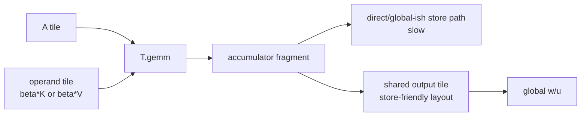

The important lesson is:

```text
Matching the arithmetic primitive is not the same as matching the pipeline.
```

Historical diagnostic evidence:

Temporary historical evidence. Replace this block with refreshed component
evidence before publication, or move it to an appendix as dated trajectory
evidence.

**Picked variant for this node:** swizzled async shared-copy store path, with
historical TileLang component latency improving from `0.46791766 ms` to
`0.27223574 ms`.

| Candidate | Correctness | TileLang latency | Same-run Triton | Lesson |
| --- | --- | ---: | ---: | --- |
| copy baseline | exact | `0.46791766 ms` | `0.30507803 ms` | correct but far behind Triton |
| no-store diagnostic | skipped by design | `0.13233657 ms` | `0.30706382 ms` | compute path was not the bottleneck |
| shared-copy store | exact | `0.37684782 ms` | `0.30497479 ms` | shared staging helped the store path |
| swizzled async shared-copy | exact | `0.27223574 ms` | `0.30525394 ms` | store-friendly layout was decisive |

This is where lowering inspection earns its place in the AKO loop. Seeing an
expected primitive in the source or generated code is not enough. The kernel
can still lose in synchronization, layout conversion, or global store traffic.
The agent can propose and test variants, but component timing and generated
code inspection decide which story is true.

### Local Wall: Fusion Alone Did Not Shorten Replay

After scale placement and store-path tuning, the natural next hypothesis was
fusion. If the pre-CP component path spends time writing and reading
intermediate `w/u/S/v_new`-like tensors, perhaps a fused kernel can keep more
of the path local and write only the final outputs.

That hypothesis was reasonable. It was also incomplete.

A direct fused skeleton can reduce materialization:

```text
q,k,v,A,g,beta
  -> fused replay/output
  -> o, final_state
```

But if the fused kernel still processes the entire sequence as one long replay
chain, the causal dependency depth is unchanged:

```text
h0 -> chunk0 -> chunk1 -> chunk2 -> ... -> chunkN
```

Figure 6 shows why this matters.

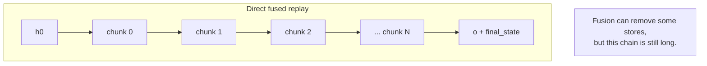

This was the Level 2 wall:

```text
less materialization != shorter recurrence
```

End-to-end wall checkpoint:

| Node | Accepted fixed-contract full-op evidence | `64K/H16` latency | Decision |
| --- | --- | ---: | --- |
| Level 2 wall | `generic_a_legacy`: generic A with legacy replay/output; direct/local fusion did not produce a better accepted long-context full-op row | `25.3849 ms` | stop local fusion as the main answer; change the replay search space |

The rejected fusion candidates were useful because they clarified the boundary.
Local fusion can improve the data path inside a schedule, but it does not
automatically change the schedule's dependency structure. A fused kernel can
write fewer tensors and still be slow if it is replaying a long prefix as one
chain.

This is the point where Level 2 runs out of room. The agent had improved
local implementation choices and identified the bottleneck, but the next
performance jump needed a different search space. That is where Level 3
begins.

## Part IV: Level 3 - External Input Changes The Search Space

Level 3 is where the search space changes. FlashQLA supplied the
production-grade CP-split replay schedule family; human mathematical analysis
supplied the blocked-inverse / Neumann-style prepare producer. The TileOps work
then became an adaptation, implementation, tuning, and productionization story
inside those expanded spaces.

Level 2 found useful local improvements, but it also found the wall. The
operator was correct and measurable. The agent could move a scale, fix a store
path, and reject shallow fusion. But the hot path still contained two deeper
problems:

1. the long replay path needed a schedule that did not process the whole
   prefix as one long recurrence chain;
2. the prepare stage needed a stronger producer shape for the chunk-local
   correction matrix `A`.

Those changes did not come from unconstrained local AKO. They came from
external input that reshaped the search space:

- Qwen FlashQLA provided the production CP-split replay schedule and fused
  replay/output skeleton;
- human mathematical analysis reframed prepare as a blocked inverse /
  Neumann-style producer.

The agent became useful again after those search spaces existed: implement
candidates, run correctness gates, inspect lowering, benchmark variants,
record decisions, and help productionize the path.

The order in this section is conceptual rather than chronological. The
human blocked inverse / Neumann-style prepare work existed before the
FlashQLA-specialized phase. The article discusses FlashQLA first here because
it explains the long-replay side of the final production path; the Neumann
section then explains the stronger TileOps A producer plugged into that
schedule family.

Figure 7 summarizes the attribution map.

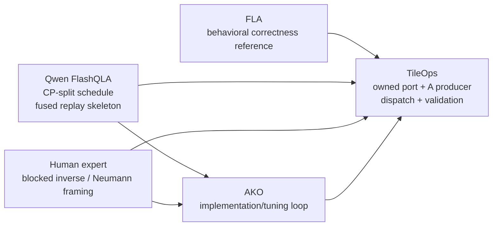

This map is deliberately blunt. It prevents both bad stories: TileOps did not
invent FlashQLA's CP-split replay schedule, and the TileOps work was not just
reproducing a finished FlashQLA kernel.

### Expert Reference: FlashQLA CP-Split Replay

Qwen FlashQLA supplied the production reference for attacking the long replay
bottleneck. TileOps did not invent the CP-split replay schedule. The
contribution was to study that schedule family, rebuild a TileOps-owned
downstream implementation, and then test it under controlled and
cross-ablation evidence. The formal V5 row below is not the performance
reproduction of FlashQLA; it is a controlled bridge row with a conservative
generic A producer.

The schedule-level idea is:

```text
first compute valid segment initial states
then run fused replay/output over shorter segments
```

This is different from direct fusion. Direct fusion can remove some global
stores while preserving one long recurrence chain:

```text
h0 -> chunk0 -> chunk1 -> chunk2 -> ... -> chunkN
```

CP split adds a preparation/correction step that makes shorter local replay
segments valid:

```text
prepare_h / correct_h0
  -> segment0: chunk0 -> ... -> chunkK
  -> segment1: chunkK+1 -> ...
  -> segment2: ...
```

Figure 8 makes the distinction explicit.

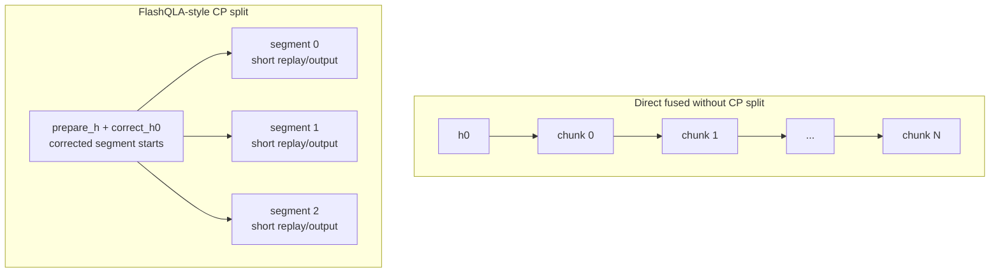

The right side must include `prepare_h/correct_h0`; CP segments are not
naturally independent. They become valid because the schedule computes
corrected segment initial states first.

At the source level, the production-shaped flow is:

```python
# Production long-prefill schedule, credited to Qwen FlashQLA.
g = chunk_local_cumsum(g)
A = kkt_solve_or_blocksolve(k, g, beta)

warmup_chunks = get_warmup_chunks(...)
h_warmup = prepare_h(k, v, A, g, beta, warmup_chunks)
h0 = correct_h0(initial_state, h_warmup, cp_metadata)

o, final_state = fused_gdr_fwd(
    q, k, v, A, g, beta,
    initial_state=h0,
    cp_seq_map=cp_seq_map,
)
```

In this skeleton, the A producer is intentionally abstract. FlashQLA supplies
the CP-split replay schedule and fused replay/output skeleton; TileOps later
plugs in its owned A producer.

The important output contract is still simple:

```text
q, k, v, g, beta -> o, final_state
```

The schedule win is that the inference prefill path avoids materializing large
global `w/u/S/v_new`-style intermediates while also shortening the replay
dependency through CP-split segment starts.

Schedule evidence:

**Picked evidence for this node:** present FlashQLA learning as a three-step
experiment, not as a single pass/fail row.

| Node | Evidence | Meaning |
| --- | --- | --- |
| local wall | direct fusion reduced some materialization but did not shorten the long replay chain; `generic_a_legacy` remained `25.3849 ms` on `64K/H16` | local AKO needed an external schedule idea |
| first correct adaptation | V5 `tileops_owned_cp_generic_a = 5.3912 ms` | the FlashQLA CP idea had been adapted into TileOps, but the result was not performance-near FlashQLA |
| pending prepare-A full row | FlashQLA-style prepare A + TileOps replay/output full combined latency: `TBD` after producer fix | this will show whether the FlashQLA-style producer plus TileOps replay reaches the expected performance neighborhood |

This third node is intentionally not filled yet. V5 was the first correct
adaptation, not the finished schedule implementation. The later full combined
row, once the FlashQLA-style producer is fixed, will show how much of the gap
is replay/output and how much is prepare-A.

That makes V5 useful rather than embarrassing. Its underperformance, together
with the mixed TileOps-owned implementation path and conservative generic A
producer, is evidence that this was an adaptation of a schedule idea rather than
a finished-kernel reproduction. The more realistic agentic pattern is: borrow a
schedule idea, build a TileOps-owned partial adaptation, observe that the first
adaptation is still incomplete, then use the failure to ask sharper attribution
questions.

Conceptually, the CP-split schedule explains the long-replay side of the
production path. The other half of the production path is the A producer, whose
stronger TileOps shape came from an earlier human blocked inverse /
Neumann-style reframing.

### Human Search-Space Expansion: Blocked Inverse / Neumann Prepare

The prepare stage builds the chunk-local correction matrix `A` used to produce
the effective writes `w` and `u`. In the FlashQLA-style flow, `A` is one of
the inputs to the CP-split replay/output path. Strengthening this producer
helps the same schedule family; it is not a different replay algorithm.

Before this point, `build_chunk_local_A` was a logical placeholder: a
chunk-local triangular/KKT-like solve that the rest of the pipeline consumed.
The human insight was to stop treating prepare as merely "write the same
triangular solve in TileLang." For a `chunk64` block, the problem can be
viewed as a blocked lower-triangular inverse/update problem:

```text
64-token chunk
-> four 16-token blocks
-> lower-triangle-only Gram products
-> local inverse / Neumann-style updates
-> chunk-local A producer
```

The useful mathematical object is the chunk-local lower-triangular correction
matrix. For a chunk of length `C`, define a strictly lower-triangular
interaction matrix:

```text
M[i, j] = beta[i] * exp(g[i] - g[j]) * <k[i], k[j]>    if i > j
M[i, j] = 0                                             otherwise
```

Then the effective writes have the shape:

```text
A = (I + M)^(-1)
W = A (diag(beta) K)
U = A (diag(beta) V)
```

This is the notation to keep in the article: `A` is a left-multiply correction
over the token axis. It turns raw beta-scaled keys and values into effective
writes that already include the causal delta-rule corrections within the
chunk.

There is one implementation convention to state carefully. In the partitioned
CP path, TileOps builds the materialized `A` with a zero gate input and passes
the chunk-local cumulative gate `g_cum` separately to the CP replay/output
path. In the older non-CP prepare path, the gate factor can be folded directly
into `A`. The blog should present the formula above as the mathematical
operator view, then say the production ABI may split the gate factor between
the A producer and the replay kernel.

A Neumann view explains why this is an attractive producer shape. Because `M`
is strictly lower triangular inside a fixed chunk:

```text
(I + M)^(-1) = I - M + M^2 - M^3 + ...
```

The series is finite in principle. The engineering point is not "use a random
approximation instead of the operator." The point is that the causal correction
has a lower-triangular inverse/update structure that can be blocked and
specialized.

For the production `chunk64, DK=128` path, TileOps splits the chunk into four
16-token blocks. If `B_r = I + M_rr` is the diagonal block and `L_rs = M_rs`
is a lower off-diagonal block, the ideal block inverse recurrence is:

```text
A_rr = B_r^(-1)
A_rs = - B_r^(-1) * sum_{m=s}^{r-1} L_rm A_ms,    r > s
```

This recurrence is the algorithmic shape behind the blocksolve producer. The
implementation computes the ten lower Gram blocks
`G00, G10, G11, ..., G33`, applies the beta/gate scalings, forms local
diagonal inverses with a Neumann-style update, and composes the off-diagonal
blocks with a fixed sequence of small GEMMs in shared memory. The accepted
variant should therefore be described as a **blocked-inverse /
Neumann-style A producer**, not as a proof that the materialized `A` is
identical to the generic exact/KKT-style producer. The formal evidence records
`A allclose=false`; full-op correctness is what is validated.

Figure 9 shows the shape.

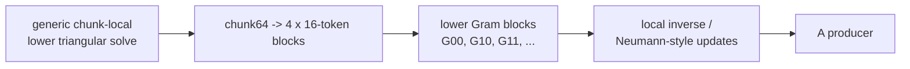

TileLang-shaped code skeleton:

```python
# 64-token chunk split into four 16-token blocks.
G00 = k0 @ k0.T
G10 = k1 @ k0.T
G11 = k1 @ k1.T
...
G33 = k3 @ k3.T

# Build beta/gate-scaled lower blocks M_rs.
B0 = I + lower(beta_gate_scale(G00))
B1 = I + lower(beta_gate_scale(G11))
B2 = I + lower(beta_gate_scale(G22))
B3 = I + lower(beta_gate_scale(G33))
L10 = beta_gate_scale(G10)
L20 = beta_gate_scale(G20)
...

# Local diagonal inverse/update.
A00 = neumann_style_inverse(B0)
A11 = neumann_style_inverse(B1)
A22 = neumann_style_inverse(B2)
A33 = neumann_style_inverse(B3)

# Compose lower off-diagonal blocks.
A10 = -A11 @ L10 @ A00
A21 = -A22 @ L21 @ A11
A20 = -A22 @ (L20 @ A00 + L21 @ A10)
...
A = assemble_lower_block_matrix(A00, A10, A11, A20, A21, A22, ...)
```

This belongs in Level 3 because the search space itself came from human
mathematical analysis. Once that framing existed, the agentic loop was useful
again: implement variants, run gates, inspect lowering, and tune inside the
new producer shape.

Formal A-producer evidence:

**Picked evidence for this node:** compare complete end-to-end rows where the
replay/output schedule is production-shaped and the prepare-A producer changes.
This section should not rely on component sums as the main claim. The one row
we still need is the corrected FlashQLA-style prepare-A producer feeding
TileOps replay/output; it is marked `TBD` until the producer port is fixed.

Evidence note:
`experiments/gated_deltanet_prefill_blog_ladder/summaries/section11_a_producer_ablation_64k_h16.md`.

| Row | Prepare-A producer | Replay/output | Timing scope | Correctness | `64K/H16` latency | Use |
| --- | --- | --- | --- | --- | ---: | --- |
| public FlashQLA full | public FlashQLA TL0.1.8 KKT | public FlashQLA TL0.1.8 CP replay | full public op | pass / public anchor | `1.304489 ms` | external baseline |
| FlashQLA-style prepare A + TileOps replay | current-TL FlashQLA-style KKT producer | TileOps PR1596 CP replay | full combined row | **TBD** | **TBD** | fill after producer fix |
| TileOps prepare A + TileOps replay | TileOps blocked-inverse / Neumann-style blocksolve A | TileOps PR1596 CP replay | full combined row | pass vs recorded FLA | `0.691642 ms` | current measured TileOps row |

The missing middle row is deliberate. Another agent is working on the
current-TL FlashQLA-style KKT producer. Until that producer is correct at
`64K/H16`, the blog should not report its latency as performance evidence. The
failed attempts are recorded only as diagnostics:

| Attempt | GEMM mode | Observed latency | Why not used |
| --- | --- | ---: | --- |
| `FQ/TO` include producers | `default` | `0.811018 ms` | correctness fail, nonfinite output |
| `FQ/TO` include producers | `legacy` | `1.958386 ms` | correctness fail, nonfinite output |
| `FQ/TO` include producers | `wgmma` | `0.808363 ms` | correctness fail, nonfinite output |

The July 1 revalidation tried a source-parity migration of the current-TL KKT
producer. The smoke row passed, but the formal 64K/H16 row still failed. The
direct diagnostic stayed producer-local: `g_cum` matched exactly, while
current-TL `A` contained hundreds of nonfinite values and saturated near fp16
limits; the exported TL0.1.8 `A` stayed finite in `[-0.269287109375, 1.0]`.

Once the FlashQLA-style producer is fixed, the Neumann prepare section should be updated by
replacing the `TBD` row with the measured full combined latency. That row will
be the clean comparison against the `0.691642 ms` TileOps prepare-A row.
Replay-only and component-sum diagnostics can remain in the evidence note, but
they should not be the headline A-producer claim.

The V5/V6 adapter rows should be kept as supporting bridge evidence only. V5
and V6 use the same CP downstream ABI and materialized A handoff shape/layout,
but they do not produce numerically equivalent A tensors. The recorded A
comparison is `allclose=false` with `max_abs=0.117279`. The supported claim is
therefore full-op correctness and compatibility under the same downstream
contract, not equality of the intermediate A tensors and not a pure
single-variable proof of the A mathematics.

### Productionization: Dispatch Is Part Of The Kernel

After the search space changed, the remaining work was not just writing one
fast kernel body. Production performance depended on choosing the right path
for the shape and recording enough metadata to make comparisons meaningful.

TileOps' productionization work includes:

- owned BTHD kernels rather than depending on an external FlashQLA call path;
- TileOps' A producer combined with the CP-split replay schedule;
- CP parameter tuning;
- H64 dispatch correction;
- correctness validation against FLA;
- benchmark metadata that records the actual dispatch path.

The dispatch metadata is part of the evidence:

```python
meta = resolve_gdn_prefill_dispatch(
    B=B,
    T=T,
    H=H,
    DK=DK,
    DV=DV,
    dtype=dtype,
    layout="BTHD",
)

kernel = select_prefill_kernel(
    use_cp=meta.use_cp,
    max_local_chunks=meta.max_local_chunks,
    block_DV=meta.block_DV,
)

record_benchmark_metadata({
    "max_local_chunks": meta.max_local_chunks,
    "cp_segments": meta.cp_segments,
    "block_DV": meta.block_DV,
    "tileops_tilelang_version": tileops_tilelang_version,
    "tileops_commit": tileops_commit,
    "flashqla_env": flashqla_env,
    "fla_version": fla_version,
    "gpu": gpu_name,
    "timer": timer_config,
    "dtype": dtype,
    "layout": "BTHD",
    "seed": seed,
})
```

Figure 10 shows the routing shape.

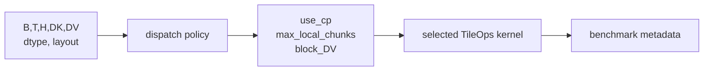

This is where the final article must be strict. Any public FlashQLA comparison
row should carry the relevant metadata: CP segment count, `max_local_chunks`,
`block_DV`, TileLang version, TileOps commit, FlashQLA environment, FLA
version, GPU, timer configuration, dtype, layout, and seed.

The current `64K/H16` formal harness also records the production-wrapper
anchor:

**Picked production candidate for this node:** `tileops_final_dispatch`,
represented by the formal `64K/H16` full-op row at `0.722839 ms`. The explicit
V6 adapter is `0.746707 ms`, so the final dispatch row is consistent with the
blocked-inverse CP path. This `1.03x` difference is a production wrapper /
dispatch-context observation, not a new algorithmic step after the producer
swap.

```text
Rerun Tier-1 correctness and benchmark tables if the PR head, TileLang wheel,
docker/runtime, dispatch heuristic, benchmark timer, GPU, or FlashQLA/FLA
environment changes.
```

## Part V: Guardrails, Evidence Snapshot, And Takeaways

The final part separates support evidence from headline evidence. Migration
lessons, prefix-scan negative results, formal `64K/H16` rows, source caveats,
and remaining publication blockers live here so the main Level 3 story does
not accidentally overclaim.

The main path is now clear: FlashQLA supplied the CP-split replay schedule,
human analysis supplied the stronger A producer shape, and TileOps turned that
combination into an owned production path. Two side lessons are still worth
keeping, but they belong after the main path because they are guardrails rather
than the spine of the story.

### Source Similarity Is Not Performance Equality

Studying FlashQLA was not a mechanical copy-and-paste exercise. The first
question was whether the same source-level skeleton preserved the same
lowering behavior in the current TileOps TileLang environment. It did not
always do so automatically.

In the migration experiments, one source-equivalent shape failed to recover
the intended TMA-specialized path:

```python
# TileLang-shaped pseudocode.
T.copy(global_tile, shared_tile)
```

The restored path needed explicit TMA-shaped movement and generated-code
inspection:

```python
# TileLang-shaped pseudocode.
T.tma_copy(global_tile, shared_tile, barrier=barrier)
T.wait_tma_barrier(barrier)  # pseudocode

lowering = inspect_generated_cuda(kernel)
assert lowering.contains_expected_tma_path
```

Figure 11 shows the lesson.

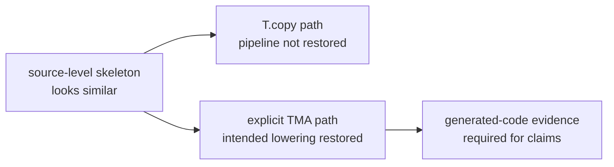

This is why the article must not claim TMA, WGMMA, or PTX/SASS behavior unless
the generated code has actually been inspected and archived. Source-level
similarity is a hypothesis; lowering evidence decides whether it is true.

Evidence shape:

| Candidate | Evidence | Scope |
| --- | --- | --- |
| source-equivalent `T.copy` migration | did not recover the intended TMA-specialized path in migration experiments | migration diagnostic |
| explicit `T.tma_copy(..., barrier=...)` path | generated-code inspection showed the intended TMA path | migration diagnostic |

### Prefix Scan Was Valid But Too Heavy For This Shape

Before and after studying FlashQLA, we also explored whether replay could be
parallelized through grouped transition composition or butterfly/prefix scan.
The mathematical idea is sound. A group of chunks can be viewed schematically
as an affine transition:

```text
T(H) = M H + b
```

and transitions compose associatively:

```text
T2(T1(H)) = (M2 M1) H + (M2 b1 + b2)
```

That reduces dependency depth in principle. But the representation is much
heavier than the direct state:

```text
direct state:       H     has shape DK x DV
full transition:    M, b  have shape DK x DK and DK x DV
augmented summary:  [b | M] has width DV + DK
```

Figure 12 shows the tradeoff. In the final illustration, this should be drawn
as two side-by-side panels: dependency depth on the left, representation cost
on the right.

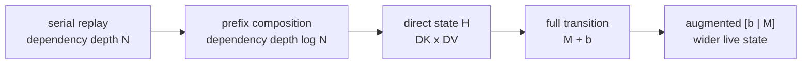

This rejects the tested full `[b | M]` transition representation for the
current `DK=DV=128`, `chunk64` production path, not a general claim that
prefix scan cannot work for GDN.

The experiments validated the affine view, but every production-shaped
insertion paid extra recurrence, summary, or output-correction cost. A future
narrower transition representation or different pipeline could still make a
prefix idea useful. For the current production path, the CP-split schedule was
the better engineering choice.

Historical negative-result evidence:

Temporary historical evidence. Replace this block with refreshed negative-result
evidence before publication, or move it to an appendix as dated trajectory
evidence.

| Candidate family | Result | Scope |
| --- | --- | --- |
| per-chunk `M @ H + b` transition application | correct but about `1.5x` slower | historical component diagnostic |
| fused direct replay + full summary | correct but about `2.2x` slower on `64K/H16` | historical negative result |
| full `[b | M]` group sweep | `group_chunks=2/4/8/16` did not rescue the representation | historical negative result |

### Formal `64K/H16` Evidence Snapshot

This section is the first formal evidence package for the rewrite, not the
complete publication table. It refreshes the main evidence table for one scoped
serving shape:

```text
B=1, T=65536, H=16, DK=DV=128, chunk64, fp16, BTHD
GPU: H200 / GPU4
timer: CUPTI kernel-only with CUDA-event fallback, warmup 10, repeat 50, trials 3
input hash: sha256:a8987a2c6d16c658a1cb8ed95e409d973a3f736e2019d8719b143f18b4741513
```

The evidence has three lanes:

| Lane | What it can support |
| --- | --- |
| Experiment-adapter rows | Full-op comparison inside TileOps experiment adapters under the same input artifact and correctness reference. |
| External/final anchors | FLA reference and production dispatch context. These rows are useful, but not experiment-adapter steps. |
| Source / ABI caveats | The limits on what intermediate equality and version claims can say. |

#### Experiment-Adapter Rows

These rows are publication-eligible evidence rows and are marked
`causal_ladder_eligible=true` in the harness output. That field name means they
are allowed into the controlled experiment table; it does not mean every row is
a headline narrative milestone. In particular, V5 is an intermediate
FlashQLA-learning row used to hold the downstream ABI fixed for the V5/V6
bridge comparison. All rows pass correctness against the same recorded
vendored FLA reference.

| Role | Variant | Blog meaning | `64K/H16` latency | Speedup vs previous | Perf vs recorded FLA (%) |
| --- | --- | --- | ---: | ---: | ---: |
| baseline | `generic_a_legacy` | current-repo generic A producer plus legacy replay/output baseline | `25.3849 ms` | `1.00x` | `73.9%` |
| first CP adaptation | `tileops_owned_cp_generic_a` | early CP-downstream bridge with a conservative generic A producer; useful control row, not a headline FlashQLA result | `5.3912 ms` | `4.71x` | `347.9%` |
| producer-swap adapter | `tileops_owned_cp_blocked_inverse_a` | same CP downstream ABI, blocked-inverse / Neumann-style blocksolve A producer | `0.746707 ms` | `7.22x` | `2511.9%` |

The end-to-end speedup across these experiment adapters is:

```text
25.3849 ms / 0.746707 ms = 33.99x
```

The experiment-adapter chain is:

```text
generic_a_legacy
  -> tileops_owned_cp_generic_a
  -> tileops_owned_cp_blocked_inverse_a
```

The V5 row should be discussed as the first correct TileOps-owned adaptation
after studying FlashQLA. It moved into the CP-split downstream structure, but
the conservative generic A producer and mixed bridge implementation kept the
full-op latency far from FlashQLA. That is useful evidence: it shows the gap
between adopting a schedule idea and reproducing a finished kernel.

The V5/V6 jump is supporting bridge evidence under the same downstream
contract: replacing the conservative generic A producer with the
blocked-inverse / Neumann-style A producer gives the faster V6 adapter row.
This is not the main Neumann prepare causal proof and not a pure ablation of the
math alone; the cleaner A-producer evidence is the A/replay cross-ablation.

The missing FlashQLA-alignment node is not V5. It is the A/replay
cross-ablation: public FlashQLA producer plus TileOps replay gives a
`1.014750 ms` estimate, faster than public FlashQLA full `1.304489 ms`; then
TileOps blocksolve A plus the same TileOps replay path gives `0.691642 ms`.

This experiment-adapter table alone is not the complete FlashQLA attribution
story. The A/replay cross-ablation below adds the missing split: with
public FlashQLA TL0.1.8 `A/g` fixed, TileOps replay reaches `0.542807 ms`, while
the public FlashQLA replay anchor is `0.864754 ms`. That means the final story
is not just "CP-split plus better A." On this tested shape, the TileOps-owned
replay/output implementation also contributes an independent speedup. The
article should still avoid saying V5 is a faithful FlashQLA reproduction,
because V5 is a generic-A bridge row rather than a public FlashQLA row.

#### External And Final Anchors

These rows should not be mixed into the experiment-adapter rows.

| Variant | Role | `64K/H16` latency | Correctness | Use in blog |
| --- | --- | ---: | --- | --- |
| `ref_fla_051` | recorded vendored FLA reference baseline | `18.7565 ms` | self/reference row | correctness oracle and FLA latency context, with version caveat |
| `tileops_final_dispatch` | PR1596 production wrapper / dispatch context | `0.722839 ms` | pass vs recorded FLA reference | final production-candidate row, not an experiment-adapter step |

The final dispatch row is slightly faster than the explicit V6 adapter:

```text
0.746707 ms / 0.722839 ms = 1.03x
```

Write this as a production wrapper / dispatch-context observation. Do not write
it as an additional algorithmic improvement after the blocked-inverse A
producer.

FlashQLA remains the public schedule and performance reference. The refreshed
public FlashQLA TL0.1.8 anchor for the same `64K/H16` shape is `1.304489 ms`
full op, with a measured `0.864754 ms` replay-only component. It must stay in
the public-environment comparison lane:

```text
TileOps vs FlashQLA is a public-environment comparison, not a controlled
same-lowering replay attribution experiment.
```

#### Source, ABI, And Correctness Caveats

The formal evidence package is clean enough for the scoped blog claim, but it
should not be overstated.

| Pair / row | ABI/source fact | Evidence |
| --- | --- | --- |
| `tileops_owned_cp_generic_a` | experiment adapter using current-repo generic A producer plus PR1596 CP downstream | generic A module `fused_prepare_compute_w_u.py`; CP downstream module `gdn_prefill/fused_fwd.py`; `used_code_root.kind=mixed_experiment_roots` |
| `tileops_owned_cp_blocked_inverse_a` | experiment adapter using PR1596 blocked-inverse / blocksolve A producer plus the same PR1596 CP downstream | blocksolve producer module `gated_deltanet_prefill.py`; CP downstream module `gdn_prefill/fused_fwd.py`; `used_code_root.kind=production_root_experiment_adapter` |
| V5/V6 A comparison | same materialized A handoff shape/layout, different producer math / numerics | `A allclose=false`, `max_abs=0.117279`, V5 `max_rel=20583.9`, V6 `max_rel=29546.4` |
| V6 adapter | explicit experiment row, not the production dispatch wrapper | `uses_production_dispatch_wrapper=false` |
| final dispatch | production wrapper from PR1596 | `uses_production_dispatch_wrapper=true` |

Safe wording:

```text
V5 and V6 use the same CP downstream ABI and materialized A handoff
shape/layout, but they use different A producers. Both rows are full-op
correct against the recorded FLA reference.
```

Do not write:

```text
V5 and V6 have numerically equivalent A tensors.
```

The FLA reference also needs a caveat. All formal rows record:

```text
reference_version_verified=false
version_status=unverified_commit_based_reference
vendor_commit_file=91d2f468944842ab2d947350d280ca1db793db57
```

This does not invalidate the TileOps experiment-adapter rows because
all rows use the same recorded reference and same input artifact for
correctness. But external FLA claims should say "recorded vendored FLA
reference" unless the package identity is independently verified before
publication.

#### A/Replay Cross-Ablation

The first formal experiment-adapter table still left a real ambiguity: if
TileOps learned the FlashQLA CP-split schedule, why did the generic-A CP row not
land near FlashQLA, and why did the final TileOps row later exceed FlashQLA?

The follow-up cross-ablation answers that more cleanly. It exports public
FlashQLA TL0.1.8 tensors, including `A`, `g_cum`, `o`, and `final_state`, and
then runs TileOps replay on the same `A/g` artifact.

Evidence notes:
`experiments/gated_deltanet_prefill_blog_ladder/summaries/section11_a_producer_ablation_64k_h16.md`
and
`experiments/gated_deltanet_prefill_blog_ladder/summaries/a_replay_cross_ablation_64k_h16.md`.

| Row | A producer | Replay/output path | Timing scope | Correctness reference | Latency |
| --- | --- | --- | --- | --- | ---: |
| `FQ/FQ` | public FlashQLA TL0.1.8 KKT | public FlashQLA TL0.1.8 CP replay | full public op | public FlashQLA self row | `1.304489 ms` |
| `FQ/FQ producer` | public FlashQLA TL0.1.8 KKT | producer-only row | `chunk_local_cumsum + kkt_solve` | component timing only | `0.471943 ms` |
| `FQ/FQ replay` | exported public FlashQLA A/g | public FlashQLA TL0.1.8 CP replay | `cp_preprocess + fused_gdr_fwd` | component timing only | `0.864754 ms` |
| `FQ18/TO` | exported public FlashQLA TL0.1.8 A/g | TileOps PR1596 CP replay | replay-only | recorded vendored FLA reference | `0.542807 ms` |
| `TO/TO replay` | TileOps blocksolve A | TileOps PR1596 CP replay | replay-only | recorded vendored FLA reference | `0.542905 ms` |
| `TO/TO full` | TileOps blocksolve A | TileOps PR1596 CP replay | include producers | recorded vendored FLA reference | `0.691642 ms` |

This changes the explanation. V5 should not be described as a faithful
FlashQLA reproduction. It is a controlled bridge row that keeps a conservative
generic A producer while moving into the TileOps-owned CP downstream ABI. That
is why it can be useful in the adapter table without being
performance-near FlashQLA.

The degradation is part of the evidence, not a result to hide. Together with
the mixed TileOps-owned implementation path and conservative generic A producer,
it shows that the agent was learning and adapting an external schedule idea
inside TileOps rather than reproducing a finished FlashQLA kernel.

The replay side does show an independent improvement. Holding public FlashQLA
`A/g` fixed, TileOps replay is faster than public FlashQLA replay:

```text
0.864754 ms / 0.542807 ms = 1.59x
```

The same TileOps replay latency appears with public FlashQLA `A/g` and with
TileOps `A/g`:

```text
FQ18 A + TileOps replay: 0.542807 ms
TileOps A + TileOps replay: 0.542905 ms
```

So the replay/output improvement is not merely a side effect of changing the A
producer.

The A producer still matters. A conservative cross-environment estimate for
"public FlashQLA producer + TileOps replay" is:

```text
0.471943 ms + 0.542807 ms = 1.014750 ms
```

This is faster than public FlashQLA full path, but slower than the same-input
TileOps full row:

```text
1.304489 ms / 1.014750 ms = 1.29x
1.014750 ms / 0.691642 ms = 1.47x
```

That sum is not a measured single fused full path: the producer number comes
from the TL0.1.8 FlashQLA docker, while the TileOps replay number comes from
the current TileOps harness. It is useful as a cross-ablation estimate, not as a
replacement for a single public benchmark row.

This is also why the Neumann prepare section should not use the `5.3912 ms -> 0.746707 ms`
adapter jump as the main A-producer proof. The cleaner ablation is:

```text
public FlashQLA producer + TileOps replay estimate: 1.014750 ms
TileOps blocksolve producer + TileOps replay:       0.691642 ms
```

We did try to replace the estimate with a measured combined row:

```text
current-TL FlashQLA-style KKT producer + TileOps replay
```

That row is measurable but not correct at `64K/H16`: `default`, `legacy`, and
`wgmma` GEMM compatibility modes all produced nonfinite outputs. The failure is
localized to the current-TL KKT producer, since `g_cum` matches the TL0.1.8
artifact while the current-TL `A` contains nonfinite/extreme values. Therefore
the measured combined row is a rejected diagnostic, not a performance point.
The July 1 source-parity and same-process TL0.1.8-source attempts did not
produce a passing 64K/H16 combined row either, so the strict publication state
is still `TBD` for that row.

The supported narrative is therefore:

```text
FlashQLA supplied the production-grade CP-split schedule family.
TileOps improved two implementation axes under that schedule family:
  1. the replay/output implementation;
  2. the A producer via the blocked-inverse / Neumann-style path.
```

#### What Still Needs A Broader Refresh

The formal `64K/H16` package replaces the old mixed historical speed ladder as
the main evidence spine. It does not replace every publication benchmark:

| Missing or pending row | Why it matters |
| --- | --- |
| broader shape table | needed before claiming the same magnitude across `32K`, `128K`, or `H32/H64` |
| broader public FlashQLA shape / percentage table | needed before reporting TileOps/FlashQLA percentages beyond the refreshed `64K/H16` anchor |
| verified FLA package identity | needed before saying externally verified FLA 0.5.1 without caveat |
| generated-code archive for TMA/WGMMA claims | needed before making low-level lowering claims |

### What The Case Study Shows

In the formal `64K/H16` evidence snapshot, the scoped TileOps path is much
faster than the recorded vendored FLA reference, but the more reusable result is
the workflow and the attribution discipline. The A/replay cross-ablation also
prevents a too-simple story: the final TileOps advantage over public FlashQLA is
not explained by "we copied CP-split and then changed A." On the tested shape,
TileOps replay/output is faster even when fed public FlashQLA `A/g`, and the
blocked-inverse / Neumann-style A producer supplies another independent
improvement.

Level 1 showed that agents are useful before performance tuning begins. They
can read papers and reference implementations, reconstruct an operator,
separate it into measurable components, and build correctness and benchmark
gates.

Level 2 showed where local agentic tuning is strong. Inside a fixed semantic
contract, the agent can search TileLang expression choices, move scale factors,
diagnose store paths, and reject tempting fusion candidates. The gate loop is
what turns this from code generation into engineering search.

Level 3 showed where local tuning is not enough. The major search-space
changes came from outside the local AKO loop: Qwen FlashQLA supplied the
production CP-split replay schedule, and human mathematical analysis supplied
the blocked inverse / Neumann-style A producer. The agent then became useful
again inside those new spaces, where it produced a TileOps-owned replay/output
implementation and production dispatch evidence.

The collaboration pattern is the main lesson:

```text
make the operator measurable
-> let agents search fixed-contract implementation space
-> use expert input to reshape the hard search spaces
-> productionize with correctness, benchmark, lowering, and dispatch gates
```

That is less sensational than "AI invented a kernel," but it is more useful.
The scoped TileOps path improved because the work combined measurable agentic
search, human mathematical judgment, expert open-source schedules, and
production evidence discipline.

### Remaining Publication Blockers

Before publication:

1. Keep the Neumann/blocksolve formulas tied to the implementation caveat:
   TileOps uses a blocked-inverse / Neumann-style producer, and the materialized
   `A` is not claimed to equal the generic exact/KKT-style producer.
2. Refresh broader-shape Tier-1 correctness and benchmark tables if the PR
   head, TileLang wheel, docker/runtime, dispatch heuristic, benchmark timer,
   GPU, or FlashQLA/FLA environment changes.
3. Fill the FlashQLA-style prepare-A `TBD` row after the producer is
   fixed. Until then, keep the component-sum rows in supporting diagnostics
   rather than the main A-producer claim. The current root-cause note is
   `experiments/gated_deltanet_prefill_blog_ladder/summaries/section11_combined_row_root_cause_20260701.md`.
4. Keep the CP-split non-originality statement.
5. Keep the hierarchical-prefix negative result scoped to the tested
   `DK=DV=128`, `chunk64` production path.
6. Keep the TileOps-vs-FlashQLA public-environment caveat and avoid replay
   algorithm attribution from full-op speedups alone.
7. Verify the FLA package identity before saying externally verified
   `FLA 0.5.1`; otherwise keep the "recorded vendored FLA reference" caveat.
